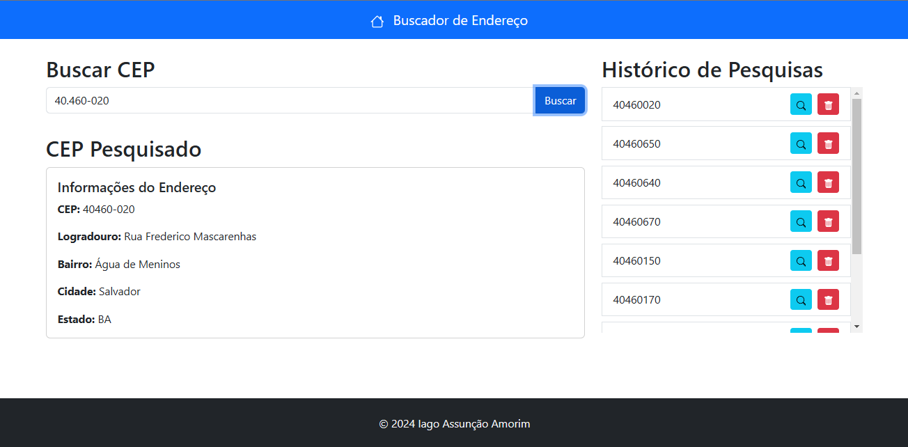
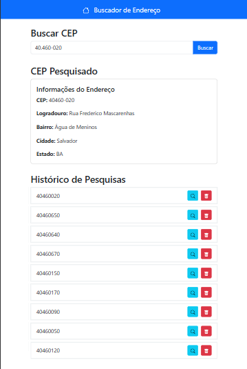
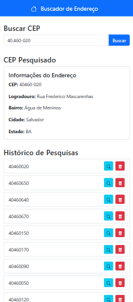

# Buscador de Endereço

Este é um projeto de uma aplicação web para busca de endereços por CEP, desenvolvido com React, Vite, Bootstrap e React-Bootstrap.

## Sumário

- [Introdução](#introdução)
- [Tecnologias Utilizadas](#tecnologias-utilizadas)
- [Funcionalidades](#funcionalidades)
- [Instalação](#instalação)
- [Uso](#uso)
- [Estrutura do Projeto](#estrutura-do-projeto)
- [Capturas de Tela](#capturas-de-tela)
- [Contribuição](#contribuição)
- [Autor](#autor)

## Introdução

O projeto Buscador de Endereço permite que usuários insiram um CEP e obtenham informações detalhadas sobre o endereço correspondente. A aplicação também mantém um histórico de pesquisas, permitindo fácil acesso a pesquisas anteriores.

## Tecnologias Utilizadas

- **React**: Biblioteca JavaScript para construção de interfaces de usuário.
- **Vite**: Ferramenta de construção rápida para projetos web modernos.
- **Bootstrap**: Framework CSS para design responsivo e componentes estilizados.
- **React-Bootstrap**: Conjunto de componentes Bootstrap totalmente construídos com React.
- **React-Bootstrap-Icons**: Conjunto de ícones para React baseado no Bootstrap Icons.

## Funcionalidades

- Busca de endereços por CEP.
- Exibição de informações detalhadas do endereço.
- Histórico de pesquisas com opção de remoção de itens.
- Interface responsiva que se adapta a diferentes tamanhos de tela.

## Instalação

1. **Clone o repositório:**

   ```bash
   git clone https://github.com/Iago-Amorim/buscador_de_endereco_react.git
   cd buscador_de_endereco_react
   ```

2. **Instale as dependências:**

   ```bash
   npm install
   ```

3. **Inicie o servidor de desenvolvimento:**

   ```bash
   npm run dev
   ```

4. **Abra o navegador e acesse:**

   ```
   http://localhost:5173
   ```

## Uso

- Digite um CEP no campo de busca e clique no botão "Buscar" para obter as informações do endereço.
- O histórico de pesquisas é exibido na lateral da tela em dispositivos maiores, ou abaixo em dispositivos móveis.
- Clique em um item do histórico para ver os detalhes do endereço correspondente.
- Use o botão de lixeira para remover um item do histórico.

## Estrutura do Projeto

```plaintext
/src
|-- /api
|   |-- viaCepApi.js         # Função para buscar endereço por CEP usando a API ViaCep
|-- /components
|   |-- CepSearch.jsx        # Componente para busca de CEP
|   |-- CepDisplay.jsx       # Componente para exibir informações do endereço
|   |-- SearchHistory.jsx    # Componente para exibir histórico de pesquisas
|   |-- Header.jsx           # Componente de cabeçalho
|   |-- Footer.jsx           # Componente de rodapé
|-- App.jsx                  # Componente principal da aplicação
|-- main.jsx                 # Ponto de entrada da aplicação
```

## Capturas de Tela





## Contribuição

1. Faça um fork do projeto.
2. Crie uma branch para sua feature (`git checkout -b feature/nova-feature`).
3. Commite suas mudanças (`git commit -m 'Adiciona nova feature'`).
4. Faça push para a branch (`git push origin feature/nova-feature`).
5. Abra um Pull Request.

## Autor

- **Iago Assunção Amorim**